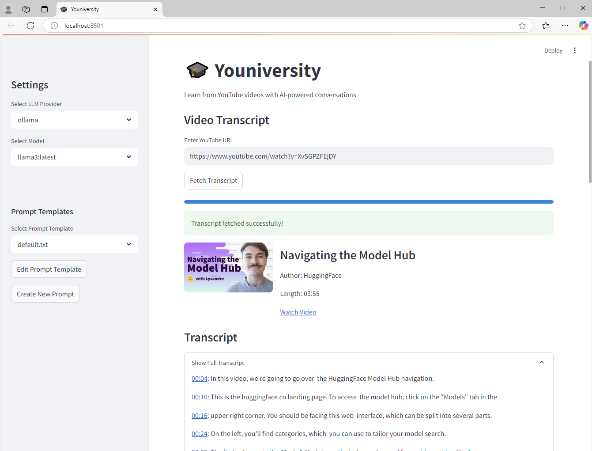
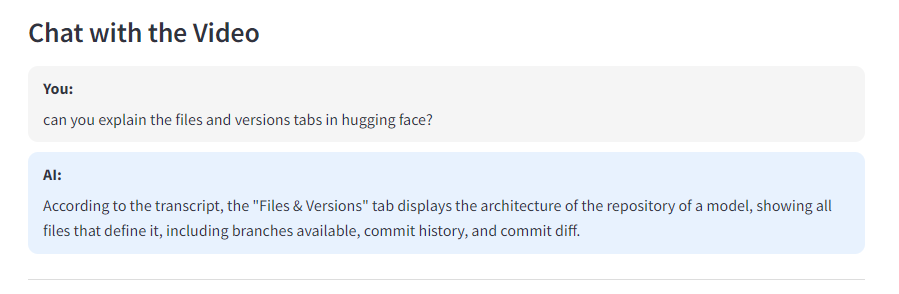

# 🎓 Youniversity

Learn from YouTube videos with AI-powered conversations. Youniversity is a Streamlit application that allows you to:

1. Enter a YouTube URL and get the transcript
2. Chat with an AI about the video content
3. Receive answers with timestamped links to the relevant parts of the video



*This is a screenshot of the youtube video being loaded and transcribed.*



*This is a screenshot of the chat interface.*

## Features

- **Transcript Extraction**: Get transcripts from YouTube videos automatically
- **Audio Transcription**: Generate transcripts from audio if no subtitle is available
- **AI Conversation**: Ask questions about the video content and get contextual answers
- **Timestamped References**: AI responses include links to the relevant parts of the video
- **Multiple LLM Providers**: Support for local LLMs (Ollama, KoboldAI), OpenAI, and Anthropic
- **Custom Prompts**: Create, edit, and manage prompt templates in the browser
- **Centralized Configuration**: All settings managed through a single configuration system

## Installation

### Prerequisites

- Python 3.8+
- A Local LLM Provider (optional):
  - [Ollama](https://ollama.ai/)
  - [KoboldAI](https://github.com/KoboldAI/KoboldAI-Client)
- API keys for OpenAI or Anthropic (optional, for cloud LLM support)

#### My tutorials for setting Ollama or KoboldAI locally
- [Ollama](https://nightfalladvisors.com/ollama-the-open-source-solution-for-your-local-llm-dreams/)
- [KoboldAI](https://nightfalladvisors.com/setup-your-own-local-ai-chatbot/)

### Setup

1. Clone this repository:
   ```bash
   git clone https://github.com/angakh/youniversity.git
   cd youniversity
   ```

2. Create and activate a virtual environment:

   **Using venv:**

   **For Windows (PowerShell):**
   ```powershell
   python -m venv venv
   .\venv\Scripts\Activate.ps1
   ```

   **For Windows (Command Prompt):**
   ```cmd
   python -m venv venv
   venv\Scripts\activate.bat
   ```

   **For macOS/Linux:**
   ```bash
   python -m venv venv
   source venv/bin/activate
   ```

   **Using uv:**
   ```bash
   # Install uv if you haven't already
   pip install uv
   
   # Create virtual environment with uv
   uv venv
   
   # For Windows (PowerShell)
   .\.venv\Scripts\Activate.ps1
   
   # For macOS/Linux
   source .venv/bin/activate
   ```

3. Install dependencies:

   **Using pip:**
   ```bash
   pip install -r requirements.txt
   ```

   **Using uv:**
   ```bash
   uv pip install -r requirements.txt
   ```

4. Create configuration file:
   ```bash
   cp .env-template .env
   ```

5. Edit the `.env` file with your preferred settings and API keys.

## Running the Application

1. Make sure your virtual environment is activated.

2. If you plan to use a local LLM provider, ensure it's running:
   ```bash
   # For Ollama
   ollama serve
   
   # For KoboldAI
   # Follow their startup instructions
   ```

3. Start the Streamlit application:
   ```bash
   streamlit run app.py
   ```

4. Open your browser at http://localhost:8501

## Usage

### Getting a Transcript

1. In the "Video Transcript" tab, paste a YouTube URL in the input field.
2. Click "Fetch Transcript" to retrieve the video's transcript.
3. If no transcript is available, the application will generate one from the audio (this may take a while depending on the video length and your computer's capabilities).

### Chatting About the Video

1. Navigate to the "Chat" tab after fetching a transcript.
2. Type your question about the video content in the input field.
3. Click "Send" to submit your question.
4. The AI will respond with information from the video, including timestamped links to relevant sections.

### Managing Prompts

1. Use the sidebar to select, edit, or create prompt templates.
2. Prompt templates control how the AI interprets and responds to your questions.
3. Click "Edit Prompt Template" to modify the currently selected template.
4. Click "Create New Prompt" to create a new template.

### Selecting LLM Providers

1. Use the sidebar to select your preferred LLM provider:
   - **Local**: Uses a locally-hosted LLM (Ollama, KoboldAI)
   - **OpenAI**: Uses OpenAI's API (requires API key)
   - **Anthropic**: Uses Anthropic's API (requires API key)
2. Choose a model from the available options for the selected provider.

## Configuration

The application configuration is managed through the `.env` file and the `config.py` module.

### Configuration File (`.env`)

```ini
# Application configuration
APP_NAME=Youniversity
DEBUG=False

# YouTube transcript configuration
WHISPER_MODEL_SIZE=base
TRANSCRIPTION_LANGUAGES=en,es,fr,de

# LLM Providers configuration
DEFAULT_PROVIDER=local

# Local LLM configuration
LOCAL_LLM_TYPE=ollama
LOCAL_LLM_API_URL=http://localhost:11434
LOCAL_LLM_STANDARD_MODEL=llama3
LOCAL_LLM_REASONING_MODEL=mistral

# OpenAI configuration
OPENAI_API_KEY=your_openai_key_here
OPENAI_DEFAULT_MODEL=gpt-4o

# Anthropic configuration
ANTHROPIC_API_KEY=your_anthropic_key_here
ANTHROPIC_DEFAULT_MODEL=claude-3-opus-20240229

# Directory paths
PROMPTS_DIR=prompts

# Model parameters
MODEL_TEMPERATURE=0.7
MODEL_MAX_TOKENS=1000
```

### Configuration Module (`config.py`)

The application uses a centralized configuration system implemented in `config.py` that:

1. Loads configuration from environment variables and the `.env` file
2. Provides typed access to configuration values
3. Sets sensible defaults for optional settings
4. Validates required configuration

## Troubleshooting

### Common Issues:

1. **No transcripts available**: Some YouTube videos don't have available transcripts. The application will attempt to generate one from the audio.

2. **Local LLM provider not found**: Ensure your selected local LLM provider (Ollama, KoboldAI) is installed and running. For Ollama, the default API endpoint is http://localhost:11434.

3. **Slow transcription**: Generating transcripts from audio can be resource-intensive. Consider reducing the Whisper model size in the `.env` file.

4. **API key errors**: Check that your OpenAI or Anthropic API keys are correctly set in the `.env` file.

5. **Configuration not loading**: Make sure your `.env` file is in the correct location and follows the proper format.

## Contributing

Contributions are welcome! Please feel free to submit a Pull Request.

## License

This project is licensed under the GNU GENERAL PUBLIC LICENSE - see the LICENSE file for details.
